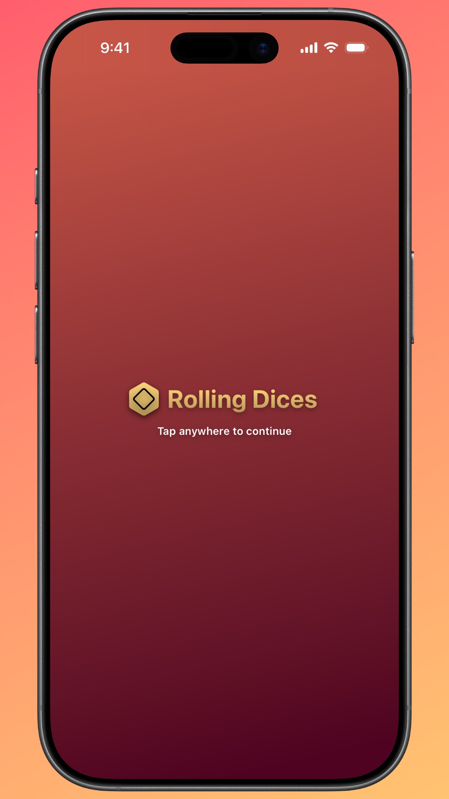
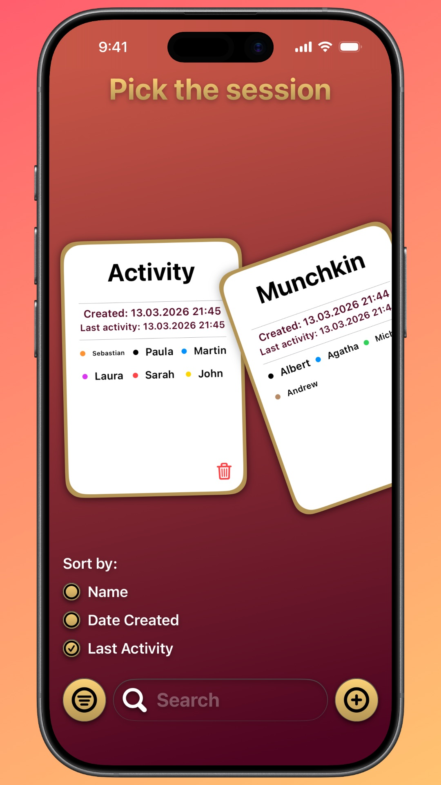
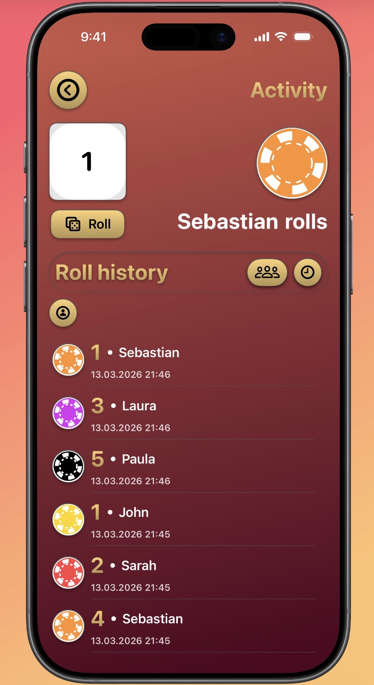

# DiceRoll

DiceRoll is an iOS app built with SwiftUI that helps you run dice-rolling sessions with multiple players. Create a session, pick the active player, and roll animated dice while the app keeps track of roll history.

## Screenshots

  

## Features
- Create and manage sessions with named players
- Animated dice roll with multi‑phase transitions (throwing, rolling, showing result)
- Player turn indicator with chip animation
- Toggle between Players picker and Roll history
- Persistent storage using SwiftData
- Clean, reusable UI components (e.g., DiceView, PokerChip, GradientBackground)

## Session Overview
- Open an active session to see the current player and dice
- Tap “Roll” to trigger the animated roll sequence
- Switch between Players and Roll history using the toolbar buttons
- The current player’s chip animates when turns change
- Roll results are recorded and shown in the history list

### Animations
These phase-based effects make interactions feel lively:
- Rolling phases: `start`, `throwing`, `rolling`, `showingResult` (handled with `phaseAnimator`)
- Player switch phases: `start`, `switching` (chip slides to indicate change)

## Requirements
- Xcode 15 or newer
- iOS 17 or newer
- Swift 5.9 or newer

## Tech Stack
- Swift
- SwiftUI
- SwiftData
- MVVM
- Combine / Swift Concurrency

## Project Structure
- Models
  - `Session`, `Player`, `RollRecord` (SwiftData models for persistence)
- Views
  - `MainMenuView`: Entry screen with app branding. Tapping anywhere navigates to `SessionsView` via a `NavigationStack`.
  - `SessionsView`: Browse, filter, and sort sessions. Displays an empty state when no sessions exist, a search/filter bar overlay, and a horizontally scrolling `SessionsListView`. Provides navigation to `AddSessionView` and to `ActiveSessionView` for a selected session.
  - `AddSessionView`: Wizard-like flow to create a new session. Switches between `AddSessionInformationView` (session name + players overview) and `AddPlayerView` (add a player and choose color). Persists the new session to SwiftData.
  - `ActiveSessionView`: Run an active session. Shows current player with animated chip, an animated dice roll, and a toggleable list area for Players picker (`ActiveSessionPlayerPickerView`) and Roll history (`ActiveSessionRollHistoryView`).
  - Reusable components: `DiceView`, `PokerChip`, `GradientBackground`
- ViewModels
  - `SessionsViewViewModel`: Loads sessions from SwiftData, manages sorting (`SortKeys`), filtering (`filterText`), computed `filteredSessions`, and UI state (filter bar visibility, delete alerts, marked session). Handles deletion and refresh of sessions.
  - `AddSessionViewViewModel`: Drives the add-session flow. Manages form state (session name validation), players list, color palette and selection, view state transitions between adding session info and adding a player, and persists a new `Session` with players to SwiftData.
  - `ActiveSessionViewViewModel`: Manages the active session lifecycle and UI state. Tracks active player, dice sides and result, roll history (with optional per-player filtering), list content state (players vs history), and orchestrates animations for rolling and player switching. Adds `RollRecord`s and updates session last activity.

## Data Persistence
App data is persisted with SwiftData:
- `Session` stores core session information (name, players, roll records)
- `Player` includes identity and color
- `RollRecord` captures result, timestamp, and player reference
- Previews use `.modelContainer(for:)` to run with in-memory containers

## Getting Started
1. Clone the repository.
2. Open the Xcode project/workspace.
3. Build and run on the iOS simulator or a device.
4. Create a session, add players, and start rolling!

## Roadmap
- Configurable dice types (d4, d6, d8, d10, d12, d20)
- Enhanced pass-and-play with auto player rotation
- Haptics and sound effects
- Unit tests

